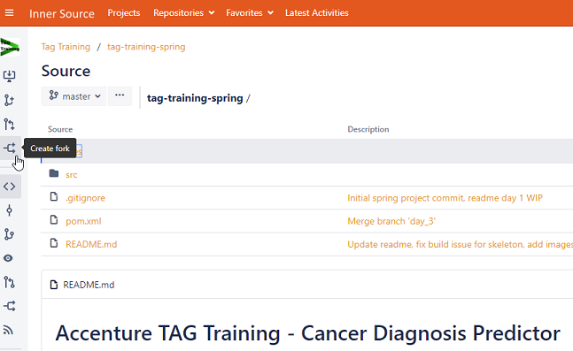
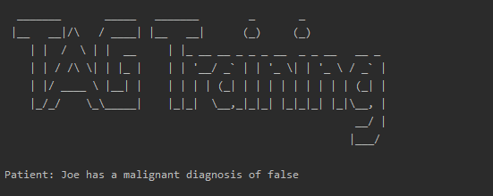
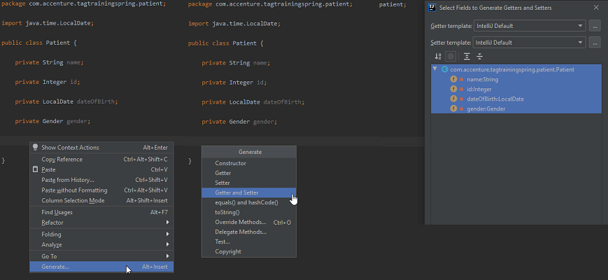
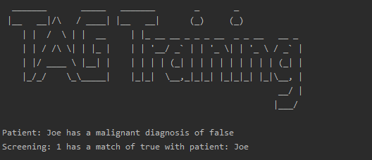
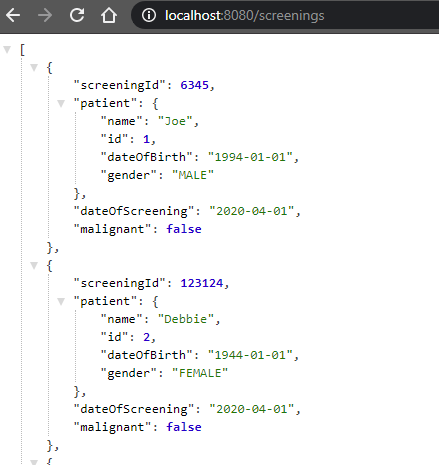

# Accenture TAG Training - Cancer Diagnosis Predictor 

Welcome to the TAG training course for Java! This Git repo contains a skeleton project ready for you to clone. Over the next few days, we'll build it up to be a fully fledged Java/Spring API. The aim of this course is to get you familiar with the basics of Java, working with Spring and sending and receiving data through web requests. 

The underlying theme of the app is that it acts as an API for doctors to access and store malignant cancer diagnoses, called screenings. Under the hood in the skeleton project is an in-memory database of about 500 cancer diagnoses taken from a well known dataset. This is the same dataset you'll be using in the AI hackathon at the end of your training. By the end of the course, you will be able to query this dataset and insert new records by using an API you built! 

Sounds exciting!

This course is perfect for complete **Java newbie's**. If you have previous experience in development, this will act as a great refresher. If not, we'll get you up to speed on the basics of how a Java app works. Each day you'll perform a number of **tasks** to build the application. Before you start a task, you should watch the related **Pluralsight** videos listed to give you a bit of background and help you complete the task. But don't rely solely on the videos or the hints in this guide. There's a wealth of information out there on the Internet, paticularly from sites such as [Stack Overflow][stack_overflow]. 

Link to PluralSight where you should have an account: https://app.pluralsight.com/library/

Some of the things we'll cover over the next few days:

  - Setting up you development environment.
  - Working with Git to clone, commit, push and merge.
  - Creating classes with variables, methods and interfaces and other Java stuff.
  - Using design patterns to solve the issue of mapping our data to Java from the database.
  - Building an API to GET and POST data to a database.
  - Writing some basic SQL.
  - Creating a front end for our app in Angular that interacts with our API.

Lets get started...

---
## Day 1

### Overview

Some of the tools we'll be using today include:

  - **Git** is used to store and manage our code. When we make a change, we want to commit it to Git so that it is saved somewhere safe. Others can then pull down our code and run or modify it. **Throughout the course, we will be committing our code to our own private repository**. To do this, we will create our own personal repository in [InnserSource][create_an_innersource_account] and then push our skeleton project to it. At the end of each day, we'll push our code up to this repo.
  - **Intellij** is the IDE we will be using to write and run our code. An IDE is our development environment for writing code. It's easy to use and contains everything we need to create and deploy Java applications.
  - **Java** is the language we use to write our code. It is based around the idea of Objects. In our case, a patient that could potentially have a malignant cancer could be a ```Patient``` object who has a name, date of birth and gender, which make up the object. 
  - **Postman** is a tool we can use to test our API. It allows us to easily send an recieve data. We will be using this starting from around Day 2.

### Pluralsight

Watch the below videos before you attempt the first task:

* [What is Git][what_is_git] - Overview of what Git is and why we use it.
* [Git Hipster Analogy][git_hipster_analogy] - Another way to think about version control systems.
* [Basic Git Commands][basic_git_commands] - Basics such as clone, push, pull & branch which you'll need.
* [What is Java][what_is_java] - Overview of Java.
* [JRE & JDK][jre_and_jdk] - A bit more background on Java. Good to know...
* [Creating a Basic Intellij Java Project][creating_a_basic_intellij_java_Project] - Another nice to know to get you familiar with Intellij. We'll be importing our project however.
* [Packages][packages] - Classes are stored in packages. They help to logically organize our code.
* [Variables][variables] - Variables are used in all programming languages to store data.
* [Classes][classes] - Classes are a how we represent our data.
* [Initializing Classes][initializing_classes] - How to create a new object.
* [Methods][methods] - These allow us to perform operations on our classes.
* [Strings][strings] - Strings represent sentences and allow us to represent information.

### Tasks

With the videos watched, we can now move onto the fun part. What we'll be doing today is setting up our development environment, cloning this repo to our local environment and start creating some basic Java classes.

#### Task 1: Setup Git and Run App
1. Setup up Git on your local PC.
2. Fork this Git repository to your personal InnerSource account and then clone it to somewhere on your computer.



3. Import the project into Intellij.
4. Run the app. You should see a welcome message in the console screen.


*Hints*
* You can install [Git for Windows][git_for_windows] to use Git on your laptop.
* A fork is just a copy of a Git repository that doesn't affect the original!
* The URL for your cloned version of this project should looks like this: https://innersource.accenture.com/scm/~alexander.kiernan/tag-training-spring-fork-test.git
* If you have any problems forking or cloning, you can simply download this project and run it locally.
* It's a good idea to have a dedicated development folder on your PC. Perhaps C:/development/projects...
* Import the project as a Maven project. We'll come to what Maven is later.

#### Task 2: Create and Initialize Some Classes
With the app up and running, we can now write some basic code. In our project, we want to represent patient's and their cancer diagnoses. We can do this using classes. Each new patient will be an object which is an instance of our patient class. These classes will contain multiple fields to represent the information we need. Read the hints for more info on how to correctly name and populate these objects.

1. First thing first is to create a new branch in git for the code we're about to write.  
2. Create a basic class to represent a ```Patient```. Put this object in the patient package. Give it the following fields:
    1. Name 
    2. Id 
    2. Date of Birth
    3. Gender
3. Create another class to represent a ```Screening```. Again, store it in the screening package.
    1. Screening Id 
    2. Patient Id
    3. Date of Screening
    4. Malignant Result (True/False)
4. Add a constructor to each class.
5. Add getters and setters for each field.
6. In the ```main``` method in the ```TagTrainingSpringApplication``` class, create a new instance of each object using some dummy data.
7. Print out the patient's name and their diagnosis to the console using a ```String```.



8. Change the ```patientId``` field in ```Screening``` to be an instance of ```Patient```. You will need to update the constructor, getters & setters.
9. Rerun the app and verify the same info is printed to the console.
10. Update the patient's name using the setter on the ```Patient``` class. Verify the new name is printed.
11. Once everything's done, merge your changes into your main branch and push it up to InnerSource!

*Hints*
* In most project you have a main branch and your own dev branch. Call the branch something identifiable, such as john_doe_dev, or day_1.
* Switching to a new branch is easy. Simply use ```git checkout -b <branch>```
* Packages help logically organize our code. You can either create a package called models for both classes or better yet a new package for each.
* [Naming] is important in Java. i.e. ```Patient``` class goes into the ```patient``` package. 
* ID fields are normally of type ```Integer```, i.e. 1, 2, 3...
* Date's can be represented using the ```LocalDate``` type.
* Gender can be easily represented using [Enums]. One is already provided!
* Constructors, getters and setters can be automatically [generated] by Intellij to save a lot of typing! (See below)



That's it for Day 1!

[stack_overflow]: <https://stackoverflow.com/questions/tagged/java>
[what_is_git]: <https://app.pluralsight.com/course-player?clipId=3fd2f988-28c6-4cbb-8851-94de23080b51>
[git_hipster_analogy]: <https://app.pluralsight.com/course-player?clipId=e9ff6152-e93f-4b08-89eb-3788cf4d58ce>
[create_an_innersource_account]: <https://innersource.accenture.com/dashboard>
[basic_git_commands]: <https://app.pluralsight.com/course-player?clipId=acfe96df-3bb7-49a7-8054-9e3d72e2c638>
[what_is_java]: <https://app.pluralsight.com/course-player?clipId=f7a9fd0c-1ee8-4628-b21c-ef5a3d246f72>
[jre_and_jdk]: <https://app.pluralsight.com/course-player?clipId=da83e7db-4c5e-4307-aad5-0826861155e2>
[creating_a_basic_intellij_java_Project]: <https://app.pluralsight.com/course-player?clipId=7e4f3268-9649-4891-bfe1-58764e5e11e9>
[variables]: <https://app.pluralsight.com/course-player?clipId=11a5bc5d-1099-43c5-b773-43045ed9bf0e>
[classes]: <https://app.pluralsight.com/course-player?clipId=6643ae8b-28b6-41fb-bba4-569ef4731e36>
[initializing_classes]: <https://app.pluralsight.com/course-player?clipId=3e20bd6d-313e-457a-9d32-50a7b07fa095> 
[methods]: <https://app.pluralsight.com/course-player?clipId=749e618f-c96d-4bd4-b189-40de5ace3cc2>
[strings]: <https://app.pluralsight.com/course-player?clipId=51951ff1-78df-4253-841d-7e8fe9e5fc8c>
[git_for_windows]: <https://git-scm.com/download/win>
[packages]: <https://app.pluralsight.com/course-player?clipId=19f914da-1abe-47dd-baf7-6018d4a14e07>
[localdate]: <http://tutorials.jenkov.com/java-date-time/localdate.html>
[naming]: <https://www.javatpoint.com/java-naming-conventions>
[generated]: <https://www.jetbrains.com/help/idea/generating-code.html>
[enums]: <https://app.pluralsight.com/course-player?clipId=b0f36740-9708-4229-a7cd-ddaaf0ccbf86>

---
## Day 2

### Overview

Yesterday we focused on creating classes with some fields to hold our data. Today we will be exploring more of the features that Java provides to do some more intricate logic stuff with our classes. 

Some of these Java things we'll cover include:
  - **Conditional Logic** also known as if-else statements are used to make decisions if something is true or false. 
  - **Loops** give us the ability to iterate over these arrays and other collections to perform operations on them.
  - **Arrays** allow us to store multiple objects together.
  - **Methods** are a core part of classes in Java. They allow us to perform operations on our objects. 

### Pluralsight

Again, watch the below videos before you attempt each of the tasks:

* [Conditional Logic][conditional_logic] - What is conditional logic in Java.
* [If-Else Statements][if_else_statements] - Most commonly used way of making decisions in Java.
* [Logical Operators][logical_operators] - We use logical operators to make decisions in our conditional logic. i.e. is 1 == 1, true.
* [Switch][switch] - Similiar to an if-else statement, but more appropiate in certain contexts. 
* [Arrays][arrays] - Way of storing multiple objects in a group.
* [Lists][lists] - A type of collection similiar to an array but with additional functions.
* [Loops][loops] - How to loop over a list of objects.
* [For-each Loop][for_each_loop] - Handy way of looping over objects.
* [Equality][equality] - For when you're trying to find a match between two objects.
* [Null][null] - Objects that have no data are null.
* [Spring Intro][spring_intro] - Watch this section of videos to get an idea of what Spring is and why we use it.
* [REST API][what_is_rest] - REST is what we use to send and recieve information. In our case it will be screening results.
* [Spring REST][spring_rest] - Here's how to do it in Spring!
* [Autowring][autowiring] and a short [demo][autowiring_demo] - The spring framework comes with handy Java annotations that reduce the amount of code we need to write. 
* [Spring Annotations][list_of_annotations] - Bit of background on the annotations we will use. In paticular, ```@Autowired```, ```@Service``` and ```@GetMapping```. 

### Tasks

We're going to be applying some of what we've learnt in the first few of the above videos to our project now. We use conditional logic to enhance some of the code we've already written. This can be used to prevent errors by checking if certain conditions are true. We can also leverage the power of collections. This allows us to process multiple objects, such as a list of ```Screening```, at once. 

Finally, we're going to add **Spring** to our project! This will allow us to make requests to our app from our browser/Postman using a URL and to get resources (like ```Screenings```) back in response. This is known as a REST API. Again, there's a lot going on under the hood with Spring but we'll just be wiring up the basics. Spring is designed to be very easy to work with and provides a number of **annotations**. These are single lines of code starting with the ```@``` symbol which do a lot of work for us. 

Let's start...

#### Task 1: Use Conditional Logic If/Else
1. First things first, check your project from yesterday is still working (printing a patients screening result) and create a new branch in Git for Day 2!
2. Create a new class called ```ScreeningService``` in the service package.
    1. Give the class a default constructor.
    2. Add a method in the new class that accepts a ```Screening``` & ```Patient``` as parameters. The method should return true or false depending on if the screening is for the specified patient.
3. In your main class, instantiate the ```ScreeningSerivce```. 
4. Pass in a screening and patient and capture the result. With the result, print a message stating if the screening matches the patient or not.



#### Task 2: Use a Loop to Iterate over Objects
1. Create 2 or 3 new ```Patient``` objects 
2. Also create a few corresponding ```Screening``` objects for each patient.
3. Create a ```List``` of screenings and add each screening to that list.
4. Using a loop, iterate over the list of screenings and print out the patient's name and their screening result.


#### Task 3: Flesh Out Service Class & Implement For-Each Loop
Now we're going to clean up our code by moving what we've written so far into separate classes. 
1. Start by creating a ```ScreeningDatabase```.  
2. Add a new public method to this class to return a list of all the screenings. Move all the patients and screenings to this class.
3. Update the ```ScreeningService``` class with a field (and its constructor) of type ```ScreeningDatabase```. 
4. Also give the ```ScreeningService``` a new method to return the list of screenings from the ```ScreeningDatabase``` object it has.
5. In your main class, create a new ```ScreeningDatabase``` object and pass it into the ```ScreeningService```.
6. Now in your main class, fetch the ```Screening``` list from the ```ScreeningService```.
7. Remove any redundant code and hit play! Check the loop still works as it did in **Task 2**.

**Extra points**
If you've finished the above, congrats! Here's one last challenge:
1. Add a second method to the ```ScreeningService``` class that takes a name, loops over all the screenings and returns the matching ```Screening```. If no match is found, return null.
2. In your main class, call this new method to get a ```Screening``` back for a name.
3. If the ```Screening``` you get back is not null, print the name and the screening result. Else, print a message stating that no screening was found.

#### Task 4: Implement Basic Spring GET Endpoint 
Finally, we're going to leverage **Spring** to Autowire our Service and Database classes! This mean that we no longer use the ```new``` keyword to create our utility classes, such as the database. Instead, Spring makes them available to us to use on-demand. These are called **beans** (for some reason). 

However, we have to first do a little bit of prep work to our code. This will allow us to fully leverage Spring and to start making requests from our browser. Our first task is to create a controller. This will take requests from our web browser and gives us back a result. In our case we want to get a screening result for a patient.

Let's begin...

1. In the screening package, create a new ```ScreeningController``` class. Annotate it with ```@RestController```. 
2. Update the ```ScreeningDatabase``` class to be a bean by adding the ```@Component``` annotation.  
3. Autowire the ```ScreeningDatabase``` into the ```ScreeningService``` class. 
4. Update the ```ScreeningService``` to itself be a service bean using the ```@Service``` annotation. You can also remove it's constructor.
5. Now, autowire the ```ScreeningService``` into the new ```ScreeningController```.
6. Now add a new method to the ```ScreeningController``` called _getScreenings_ which returns a list of ```Screening```. This is our first API method which returns all the screenings we have.
7. Update this new method to call the ```ScreeningService``` get screenings method and return the list of ```Screening```.
8. Add the Spring ```@GetMapping("/screenings")``` annotation to our new method. This is our URL to access the endpoint.
9. Run the Spring app and test it out! Try hitting ```http://localhost:8080/screenings``` from **Postman** or **Chrome** and all the screenings should be returned in JSON.
10. Don't forget to merge your Day 2 changes into your master branch and push to InnerSource!



*Hints*
* Your main class by the end of task 4 should only have the line ```SpringApplication.run(TagTrainingSpringApplication.class, args);```
* Install a JSON formatter in Chrome to prettify your JSON.
* Spring uses a library called Jackson to automatically formot our objects as JSON. 

[conditional_logic]: <https://app.pluralsight.com/course-player?clipId=08c83d54-1d3e-456a-b122-cb3673f607b3>
[if_else_statements]: <https://app.pluralsight.com/course-player?clipId=a8930d13-7598-4dd4-b2c6-6b7b0af0f90a>
[logical_operators]: <https://app.pluralsight.com/course-player?clipId=967235c1-a424-41a4-9918-f9646086ee10>
[switch]: <https://app.pluralsight.com/course-player?clipId=25d15753-fb1b-4fe8-a8e6-38224b46dab8>
[lists]: <https://www.geeksforgeeks.org/list-interface-java-examples/>
[loops]: <https://app.pluralsight.com/course-player?clipId=3ba624b3-c92c-448c-b7ee-c049d6efaf56>
[arrays]: <https://app.pluralsight.com/course-player?clipId=03ae8d9a-388d-4b66-a5e3-d07ea816ea33>
[for_each_loop]: <https://app.pluralsight.com/course-player?clipId=212fb6c9-95bd-4f6b-8a26-11057209fae0>
[equality]: <https://app.pluralsight.com/course-player?clipId=f2819dd2-aff3-4151-b518-4c0567420bec>
[null]: <https://app.pluralsight.com/course-player?clipId=c7af73fd-11f5-4f01-910e-e1b26c3e6268>
[spring_intro]: <https://app.pluralsight.com/course-player?clipId=e8197f0f-d207-463f-aca4-7eeb975f30b2>
[what_is_rest]: <https://app.pluralsight.com/player?course=rest-fundamentals&author=howard-dierking&name=rest-m1-intro&clip=1&mode=live>
[spring_rest]: <https://spring.io/guides/gs/rest-service/>
[autowiring]: <https://app.pluralsight.com/course-player?clipId=e3e71c50-7283-4788-a62f-392a5ef9dfb4>
[autowiring_demo]: <https://app.pluralsight.com/course-player?clipId=aa960afc-3bf1-4ed8-bcab-d7f9ab52500f>
[list_of_annotations]: <https://springframework.guru/spring-framework-annotations/>

---
## Day 3

### Overview
For the final day of Java training, well be fleshing out our API to retrieve and create screenings. To do this, we'll be leveraging the power of Spring. Spring has many powerful tools for manipulating data, particularly for creating APIs. The annotations it provides will allows us to easily read and insert data. We'll also be implementing a simple Design Pattern to access our data, as well as implementing an interface and doing some basic interactions with a database.  

In the background of our Spring app is a prepopulated, in-memory database of screenings. This is what we're going to be interacting with today to get and store data through our API. The database contains about 500 screenings with each one being uniquely identified by an *id*. This id belongs to a single patient. Our Spring app interacts with the database using the power of SQL. We'll only have to write a few lines to get things up and running.     

### Pluralsight

Below are several videos to watch related to Spring, Maven, HTTP, API's and databases, all of which we're going to cover in the tasks for today:

* [Maven][what_is_maven] - Maven is what we use to manage dependencies in our project. Lombok is one of these.
* [Lombok][what_is_lombok] - Lombok reduces the amount of repetitive code we need to write. Such as getters/setters and even constructors.
* [JSON][what_is_json] - JSON is a way of formatting our objects in a standard format so they can be used by other programs. This is useful in our case when we want to send a screening to our frontend!
* [Design Patterns][design_patterns_intro] - Design patterns are proven coding solutions to common occuring problems in software design. We'll be using the DAO (Data Access Object) pattern to get our Screenings from a database! 
* [Interfaces][interfaces] - Part of implementing our DAO requires creating an interface. This is like a Java contract which is implemented by our classes.
* [What is CRUD][what_is_crud] - Acronym for Create, Read, Update and Delete used commonly with APIs. In our case we are going to Read and Create screenings. Link also contains some good examples of JSON and how it's used in CRUD operations.
* [Intro to Databases/SQL][intro_to_sql] - We'll be writing a small bit of SQL to get data from our local database.
* [SELECT statements in SQL][sql_select] - SELECTs are used to **GET** the data we want from the database.
* [INSERTS statements in SQL][sql_insert] - INSERTs are used to add data to a database.
* [Exceptions][exceptions] - Java throws exceptions when it hits a problem, such as no data coming back after running a SQL query. We can catch these and handle them cleanly in our program.

#### Task 1: Implement Lombok & Clean Up Code
Our first task will be to add a new class to represent all the data in a malignant cancer screening. As you can see from the [file][malignant_dataset_file], which represents malignant screenings for a number of patient's, there are quite a lot of fields we will need in our class! If we were to write a getter/setter for each field, the class would run to 100's of lines.

To get around this, we can use a code generation tool called [Lombok][project_lombok]. Lombok will create getters/setters on the class at runtime, saving us from having to explicitly write them. Now instead of having a bloated class file, we simply have Lombok do all the work using 2 simple annotations at the top of the class! 

Let's do this now:

1. Install the Lombok plugin for Intellij and enable annotation processing. 
2. Now add the Lombok dependency to our pom.xml.
3. In the ```Screening``` class, delete every field and constructor.
4. Copy the premade fields from [here][result_fields] and paste them as fields into your empty ```Screening``` class.
5. Now add the Lombok ```@Getter``` and ```@Setter``` annotation to the ```Screening``` class. 
6. Do the same in the ```Patient``` classes. Delete the existing explicit getters/setters/constructors and add the annotations.

Now we just need to clean up our code to factor in our changes to the ```Screening``` class!
1. The ```Screening``` class no longer contains a ```Patient``` object. Update the ```Patient``` object to have an *id* which matches the *id* field in the ```Screening``` class.
2. We deleted the constructor earlier from the ```Patient``` object. Add a Lombok ```AllArgsConstructor``` annotation to replace it.
3. Update the ```ScreeningController``` to return the ```diagnosis``` field from a ```Screening``` instead of the old boolean.
4. In the same class, update all references to the String ```name``` to use an int ```id``` field instead.
5. Update the ```ScreeningService``` to take the ID for a patient and return the appropriate screening.
6. In the same class, you can delete the ```checkScreening``` and ```printScreeningResult``` methods.
7. Finally, update the ```ScreeningDatabase``` patient's objects with existing id's from the [maliginant dataset file][malignant_dataset_file], i.e *842302*. Also, delete any ```Screening``` objects and just return an empty list for now. We'll be updating this later.
8. Check if everything builds ok then hit the screening endpoint with any id. *We don't have any screenings at this point!*

Our objects should now be wired with Lombok! The amount of what is called *BoilerPlate* code has been significantly reduced and our classes look much cleaner. Next, we need to populate our ```Screening``` fields with data! 

We'll do this now in Task 2...

*Hints*
* We just need to do 2 things to setup [Lombok in Intellij][intellij_lombok]. That is enable annotation processing in settings and add the Lombok plugin for Intellij.  
* You can find the Maven dependency for Lombok here https://mvnrepository.com/artifact/org.projectlombok/lombok/1.18.12. Simply copy and paste this into your dependency section in your pom.xml (Project Object Model) file.
* You can remove empty constructor from any of our Bean classes.
* The new screening endpoint should look something like this http://localhost:8080/screenings/842302

#### Task 2: Write SQL & Read Data from Database
Now we're ready to implement the population of screenings from our local database. Running in the background of our Spring app is an in memory database with 100's of [screenings][list_of_sql_screenings]. What we're going to do now is implement a few changes so that we can get this data!

First we need to create our contract for accessing the Screening data from our local database.
1. Create a new interface ```ScreeningDao``` in the screening package.
2. Give the interface 2 methods.
    1. Get a ```Screening``` for a patient id.
    2. Get all the ```Screenings```.
3. Have the ```ScreeningDatabase``` implement the ```ScreeningDao```. 
4. To polish everything off, rename the ```ScreeningDatabase``` to ```ScreeningDaoImpl```.  
5. Lastly, delete the ```ScreeningSerivce``` and update the references to it to ```ScreeninfDao```where it's referenced in the ```ScreeningContoller```. Also update the method the controller uses to the new interface method to get a single ```Screening```. 
6. Lastly, lastly, delete the ```screeningStore``` method from our ScreeningDaoImpl. Save the Patient objects as we'll need them later.
5. Check everything is still working!

Now we're going to write some SQL to get screenings from the local database. 
1. First autowire the ```JdbcTemplate``` Bean into our ```ScreeningDaoImpl```. This is used to executre our SQL.
2. Create a new *String* to represent an SQL statement to get all the fields from the table *screening_results*.
3. Add [this][screening_jdbc_all] line to your method which will use the JDBCTemplate to attempt to execute your SQL and return a list of ```Screenings```. 
4. Do the same for a single patient id. Use [this][screening_jdbc_single] Java code to execute your SQL to return just a single ```Screening```.
5. Update both methods 
5. Update the ```ScreeningController``` existing get method to directly return a ```Screening```. Spring will automatically convert the object to JSON for us as we are using the ```@RestController``` annotation. 
7. Add a new method to the ```ScreeningController``` to get all screenings. Again, return a list ```Screening```.
8. Run the app and check that the endpoints are now working. 

**To Test the Endpoints**: Try a patient id that does exist and one that does not. You should get an error for the one that does not exist. This is an exception and we will be updating our code to better handle this later. Also, try the endpoint to get all Screenings. It should return every ```Screening``` from the database as one big blob of JSON.

*Hints*
* Intellij can implement the methods from an interface automatically for you. Click the red ballon after you have added the ```implements ScreeningDao``` line to the ```ScreeningDatabase``` and click *Implement Methods*.
* To easily rename a class and all it's references in Intellij, right click the class in the Project menu and click refactor -> rename.
* The ```ScreeningRowMapper```  maps the SQL screening result to our Java ```Screening``` objects.

#### Task 3: Insert Data into Database
In the previous task we selected, or **Read**, screenings. Now we are going to **Create** them. 

1. Add a new method signature to the ```ScreeningController``` that's purpose is to update a screening.  
2. Give it an annotation of ```@PostMapping("screenings")```. 
3. Also give it a ```@RequestBody``` of ```Screening```. This means that we expect a JSON version of a screening to be sent in the request to our app. 
4. Update the ```ScreeningDao``` with a new save method. It should take a ```Screening``` as a parameter.
5. Implement this method in the ```ScreeningDaoImpl```. Using the ```jdbcTemplate.update()```, write SQL to insert a new row into ```screening_results``` with the values ```id```, ```diagnosis```, ```symmetry_mean``` and ```group_id```.

Now we're ready to send some JSON to our new endpoint!
1. In **PostMan**, create a new request with a method type of **Post**. 
2. Get a JSON ```Screening``` from the single screening endpoint and paste it into the *Body -> raw JSON* tab of the request in PostMan. 
3. **Modify** some of the values on the request, particularly  the screening *id*.
4. Send it and verify your new screening exists by fetching the screening for the new patient id.

That's it, you've now created an API using Spring!

#### Task 4: Exceptions
For our final task, we're going to implement a small bit of exception handling. This is to catch errors the our Java program throws when we don't get any results back after running our SQL.

1. In the ```ScreeningDaoImpl``` get for patient id method, implement an empty try/catch block.
2. Wrap your ```jdmbcTemplate.queryForObject()``` code in the try block.
3. In the catch block, you want to catch the Exception type ```EmptyResultDataAccessException```.
4. Print a helpful message in the catch block. 

For extra points, you can implement logging! Logs are what we analyze on live systems to see where errors occurred.
1. At the top of the ```ScreeningDaoImpl``` class, add the annotation ```@Slf4j```. This is our logging library.
2. In the catch method, replace the message with ```log.info("..."")``` for example.
3. Run the app and try a patient id that doesn't exist. Verify the log message shows on the console output.

Done! We have now implemented **C** and **R** from **CRUD** in our Screening API. 

[malignant_dataset_file]: <https://innersource.accenture.com/projects/TTSA/repos/tag-training-spring/browse/src/main/resources/malignant_cancer_dataset.csv?at=day_3>
[project_lombok]: <https://projectlombok.org/>
[design_patterns_intro]: <https://app.pluralsight.com/player?course=patterns-library&author=david-starr&name=pattern-introduction&clip=1&mode=live>
[interfaces]: <https://app.pluralsight.com/course-player?clipId=d4231326-1038-403d-99e9-686dc460eb59>
[what_is_maven]: <https://app.pluralsight.com/course-player?clipId=b70e1c45-eeb9-4c8b-a87c-ae14e68f2828>
[what_is_lombok]: <https://www.vogella.com/tutorials/Lombok/article.html>
[what_is_json]: <https://app.pluralsight.com/course-player?clipId=ae43bd39-46e6-41b3-b005-0ba6cc29d020>
[intellij_lombok]: <https://www.baeldung.com/lombok-ide>
[result_fields]: <https://innersource.accenture.com/projects/TTSA/repos/tag-training-spring/browse/files/result_fields?at=refs%2Fheads%2Fday_3>
[dao_pattern]: <https://www.tutorialspoint.com/design_pattern/data_access_object_pattern.htm>
[what_is_crud]: <https://www.codecademy.com/articles/what-is-crud>
[intro_to_sql]: <https://app.pluralsight.com/course-player?clipId=6ab80ae6-a01f-4e9d-b5d6-d1258a00bfd0>
[sql_select]: <https://app.pluralsight.com/course-player?clipId=07e1f022-3398-445b-a077-0665a62da7dc>
[sql_insert]: <https://app.pluralsight.com/course-player?clipId=7f52450a-2b0b-443a-bd52-d17b64c553f8>
[list_of_sql_screenings]: <https://innersource.accenture.com/projects/TTSA/repos/tag-training-spring/browse/src/main/resources/db/data.sql?at=refs%2Fheads%2Fday_3>
[screening_jdbc_single]: <https://innersource.accenture.com/projects/TTSA/repos/tag-training-spring/browse/files/get_single_screening_query?at=day_3>
[screening_jdbc_all]: <https://innersource.accenture.com/projects/TTSA/repos/tag-training-spring/browse/files/get_all_screenings_query?at=day_3>
[request_mapping_example]: <https://www.baeldung.com/spring-requestmapping#1-requestmapping---by-path>
[exceptions]: <https://app.pluralsight.com/course-player?clipId=fdc2608f-2949-46ef-9c07-92e50fcec29d>
